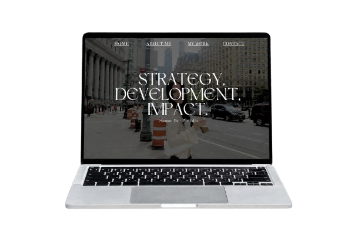

<h2 align="center">
Simone Yu — Portfolio  

<h4 align="center">
Product manager combining data, customer insight, and creative storytelling
to build thoughtful digital experiences.  

  

[View My Portfolio](https://simshan-jpg.github.io/pm_portfolio/) ·
[Creative Side Projects](https://simoneyu.my.canva.site/) ·
[LinkedIn](https://www.linkedin.com/in/simone-yuu/) ·

## About Me

I’m a UCLA graduate with a background in Statistics & Data Science and
Film, Television, and Digital Media.

My experience spans product management, ads measurement, product strategy,
user research, data analysis, and digital storytelling. I enjoy translating
complex customer and business problems into clear, intuitive products.

# Most Recent In-Depth Case Study

### AI-Powered Fashion Discovery

Designed a personalized fashion-discovery experience that helps shoppers
build complete outfits based on occasion, aesthetic, budget, weather,
sizing, and product availability.

**What I worked on:** User research, interview synthesis, product strategy,
recommendation logic, wireframes, prototyping, and success metrics.

[Read the Case Study](YOUR_CASE_STUDY_LINK)

---
## Most Recent App (In Progress)

change later!!!Designed a personalized fashion-discovery experience that helps shoppers
build complete outfits based on occasion, aesthetic, budget, weather,
sizing, and product availability.

**What I worked on:** User research, interview synthesis, product strategy,
recommendation logic, wireframes, prototyping, and success metrics.

[Read the Case Study](YOUR_CASE_STUDY_LINK)

_Explore all of my projects at this [link!](https://https://carpal-knot-835.notion.site/Simone-Yu-PM-Portfolio-1692de0cb677805aa304eb207043f7d7) ·
_

Explored how advertisers can better understand campaign performance and
make more confident optimization decisions.

**What I worked on:** Product discovery, advertiser pain points, data
analysis, product requirements, experimentation, and measurement.

[Read the Case Study](YOUR_CASE_STUDY_LINK)

---

### AI-Assisted Enterprise Support

Developed a product strategy for using AI to improve enterprise support
workflows and help users resolve problems more efficiently.

**What I worked on:** Competitive research, LLM evaluation, service design,
prioritization, KPI definition, and implementation planning.

[Read the Case Study](YOUR_CASE_STUDY_LINK)

# My Approach to Building (And Confidently Owning!) a Product

* I lead my customer/product discovery through interviews (if applicable), market research, workflow analysis, behavioral, and other data—turning findings into clear product opportunities that fit our business objectives

* I translate our customer/business needs into detailed product requirements, user stories, account-mapping rules, success metrics, and roadmap priorities.

* I define and evaluate high-level product KPIs (campaign discrepancies, conversion rates, click-through rates, engagement, adoption, onboarding time, etc.)

* I design/iterate user journeys, wireframes, and prototypes in close partnership with the design, engineering, content, operations, and business teams. 

* I validate our product direction (usually closely with the engineering team from here specifically) through usability testing, beta feedback, analytics, hypothesis testing, and A/B experimentation.

* I manage execution through backlog refinement, launch-readiness reviews, documentation, risk identification, partner alignment, and post-launch iteration.

* I apply SQL, Python, dashboards, and other data visualization methods to identify any gaps, monitor performance frequently, and then communicate my recommendations to leadership and stakeholders.

Most of my workflows are HIGHLY focused on exploring the most fitting AI and machine-learning applications. This has included recommendation systems, collaborative filtering, help-desk automation, company-built AI bots _(most recent example: Using AIME at my PM internship @TikTok)_, and rapid AI prototyping—to improve our operational workflows.
  

## Tools & Technical Skills

**Product & Collaboration:** Figma · Jira · Confluence · Notion · Miro · GitHub

**Data & Development:** SQL · Python · R · JavaScript · HTML/CSS · Pandas · NumPy · Tableau · Power BI · Excel · Google Analytics · GA4 · Salesforce

**Product Methods:** Agile · Product Analytics · A/B Testing · Hypothesis Testing · Data Visualization

## AI Product Stack Experience

**Build & Prototype:** Figma Make · Claude Code · Cursor · Lovable

**Models & Intelligence:** GPT-4/OpenAI · Google AI Studio · Cohere · AIME by ByteDance · Collaborative Filtering · Recommendation Systems · Prompt Engineering

**Automate & Deploy:** Zapier · Vercel

